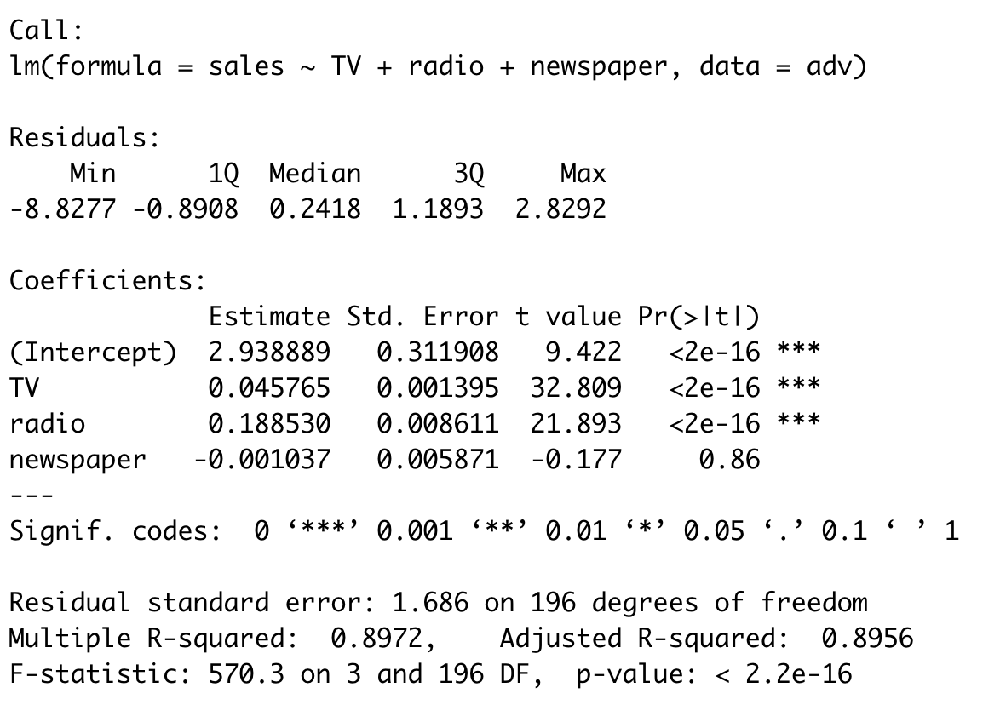
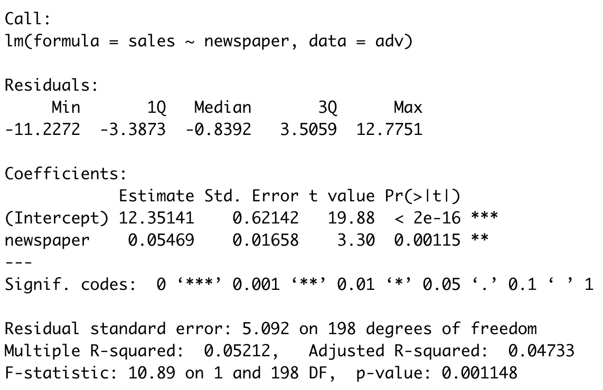
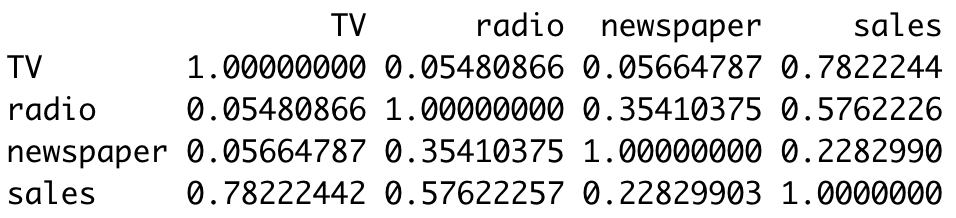

# Week 1 - Intro + Linear Regression (Part 1)

CM of 2h followed by a TD of 1h

### Introduction (30 min)

-- **Presentations**

- Pedro's and Romain's e-mail for questions:
  - [pedro.rodrigues@inria.fr](mailto:pedro.rodrigues@inria.fr)
  - [romain.rombourg@gmail.com](mailto:romain.rombourg@gmail.com)
- Website of the course at Chamillo
  - https://chamilo.grenoble-inp.fr/courses/ENSIMAG4MMSADM/
- TD and TP, with groups of 3 to be organized by you
  - I will need the names by next week
  - Groups will be formed on TEIDE
- Office hours organized by Daria Bystrova
  - [daria.bystrova@inria.fr](mailto:daria.bystrova@inria.fr)

- Four or five TPs with reports to be delivered on TEIDE in English
  - To be decided with Romain and Jean-Baptiste
- Final grade: half average of TPs, half final exam (like a TP but solo)

-- **Examples of what we will be doing in this course**

We will be learning tools for *understanding data* from the real world and being able to do many different tasks, such as:

- Predicting the salary of a person based on its age, education, height, etc -- **regression**

- Classifying a bird as coming from north america or europe based on its genetic code -- **classification**

- Grouping customers into categories based on the history of their online purchases -- **clustering**

This is what people often call machine learning or data science, and this course will give you some of the basic tools to start working in this domain.

-- **Particularity of our course on statistical learning**

There are many ways of teaching machine learning, statistical learning, data science, etc. Some courses will be more **computational** and aim for the most modern and powerful tools available in the literature. 

Others will start from the basics and give more emphasis on **classic** methods which are not necessarily state of the art, but have been there for many years and are very **well understood**. 

Most importantly, these simpler methods allow for clearer interpretation of results and some sense of "quality certificate" for each step of a given data analysis (e.g. confidence intervals). We will be following the latter approach.

-- **Summary of the tools you will learn**

In summary, the new tools that you are going to learn in this course are

- Multiple linear regression
- Principal component analysis (PCA)
- Linear classification (LDA, Naive Bayes)
- Graph clustering

All of these methods are pretty standard and there are many references for better understanding them. An excellent source for going further on what we will be covering here is the free online book by Hastie et al.

> Hastie, Tibshirani, and Friedman - "The elements of statistical learning"
> https://hastie.su.domains/ElemStatLearn/

-- **Supervised vs unsupervised**

The statistical methods mentioned before fall into one of two categories: *supervised* or *unsupervised*

In *supervised* methods, our goal is to learn the relation between an input variable $X$ and an output $Y$. In *unsupervised* settings there are inputs but no supervising outputs and the goal is to learn relationships and structure from the data.

> In the examples mentioned before, which ones are supervised and unsupervised?

> **Interview question**: How would you evaluate the performance of a supervised method? What about an unsupervised one?

In this lecture, we will be considering one of the simplest examples of supervised model.

### Linear Regression (1h30)

Linear regression is the oldest kind of statistical model and also the simplest one. Despite its clear limitations, it is widely used because of its many interesting properties and the possibility of easily extending it so to make it more powerful on specific situations. 

If we want to predict a real-valued output $Y$, for instance the salary of a person, based on an input vector $X = (X_1, \dots, X_p)$ consisting of $p$-predictors, e.g. education, age, height, etc., our linear model is written as
$$
Y = \beta_0 + \beta_1 X_1 + \dots + \beta_p X_p + \varepsilon
$$

- Coefficient $\beta_0$ is the intercept of the model and is interpreted as the expected value of $Y$ when the other predictors are set to 0
- For $i > 0$, the $\beta_i \in \mathbb{R}$ are called the coefficients of the model and should be interpreted as *the average effect on Y of a one unit increase in $X_i$ while holding all others predictors fixed*
- Quantity $\varepsilon$ is a random error term independent of $X$ and with zero mean which may represent several aspects of the modeling, such as an irreducible noise due to the intrinsic stochastic behavior of a given systems or the role of predictors which were not included into the model.

To come up with an estimate for the parameters $\beta = (\beta_0, \beta_1, \dots, \beta_p) \in \mathbb{R}^{p+1}$ we base ourselves on a training dataset containing $N$ examples $(x_i, y_i)$ of the relation between a given $x_i = (x_{i1}, \dots, x_{ip}) \in \mathbb{R}^p$ and an output $y_i \in \mathbb{R}$ and define an **objective** function $\mathcal{L}$ as:
$$
\mathcal{L}(\beta) = \sum_{i = 1}^{N} \left(y_i - \beta_0 - \sum_{j = 1}^p x_{ij} \beta_j\right)^2
$$
which is a least-squares approach to fitting this model. Note that we could have chosen other kinds of loss functions, like taking the absolute difference between the residuals or summing a term taking into account the magnitude of the coefficients. This is, indeed, very often done in practice, but it is out of the scope of our course. 

> **Interview question**: Why do we use the L2 norm by default? What are some good reasons for this?

The vector $\hat{\beta}$ which minimizes the loss function and, therefore, best describes the linear relation between the input predictors $X = (X_1, \dots, X_p)$ and the output $Y$, is expressed as
$$
\hat{\beta} = (\boldsymbol{X}^T \boldsymbol{X})^{-1}\boldsymbol{X}^T\boldsymbol{y}
$$
where
$$
\boldsymbol{X} = \left[
\begin{array}{cccc}
1 & x_{11} & \dots & x_{1p} \\
\vdots & \vdots & \ddots & \vdots \\
1 & x_{n1} & \dots & x_{np} 
\end{array}
\right] \in \mathbb{R}^{n \times (p+1)} \quad \text{and} \quad \boldsymbol{y} = 
\left[
\begin{array}{c}
y_1 \\
\vdots \\
y_n
\end{array}
\right] \in \mathbb{R}^{n}
$$
> **Demo:** First notice that the objective function can be written as 
> $$
> \mathcal{L}(\beta) = \|\boldsymbol{y} - \boldsymbol{X}\beta\|^2 = (\boldsymbol{y}-\boldsymbol{X}\beta)^T(\boldsymbol{y}-\boldsymbol{X}\beta) = \boldsymbol{y}^{T}\boldsymbol{y} - \boldsymbol{y}^T \boldsymbol{X} \beta - \beta^T \boldsymbol{X}^T \boldsymbol{y} + \beta^T (\boldsymbol{X}^T\boldsymbol{X}) \beta
> $$
> Simplifying things, we can write that
> $$
> \mathcal{L}(\beta) = \boldsymbol{y}^T\boldsymbol{y} - 2~(\boldsymbol{X}^T {\boldsymbol{y}})^T \beta + \beta^T (\boldsymbol{X}^T \boldsymbol{X})~\beta
> $$
> and then derive the loss function with respect to each of the parameters $\beta_i$ which gives us:
> $$
> \nabla \mathcal{L}(\beta) = -2 \boldsymbol{X}^T \boldsymbol{y} + 2 (\boldsymbol{X}^T\boldsymbol{X})\beta = 0 \iff \hat{\beta} = (\boldsymbol{X}^T \boldsymbol{X})^{-1}\boldsymbol{X}^T\boldsymbol{y}
> $$

The fitted values are
$$
\hat{\boldsymbol{y}} = \boldsymbol{X}\hat{\beta} = \boldsymbol{X}(\boldsymbol{X}^T \boldsymbol{X})^{-1}\boldsymbol{X}^T\boldsymbol{y} = \boldsymbol{H}\boldsymbol{y}
$$
where matrix $\boldsymbol{H}$ can be interpreted as a projection matrix: it orthogonally projects vector $\boldsymbol{y}$ on the linear space spanned by the columns of $\boldsymbol{X}$. 

> **Interview question:** Suppose we started a regression with $N$ data points $(x_i, y_i)$ and obtained a first approximation of the coefficients given by $\beta_N$. Now we have a new data point, making the training set of size $N+1$. Do we need to recalculate $\beta_{N+1}$ from scratch? Or can we reuse $\beta_N$ somehow? This is what we can recursive least squares (RLS).

-- **Quality of the results via $\boldsymbol{R^2}$**

To assess the quality of the model fit, we evaluate how far the predictions $\hat{y}_i$ are from the actual observation $y_i$, we have then the Residual Sum of Squares:
$$
\text{RSS} = \sum_{k = 1}^{N}(y_i - \hat{y}_i)^2
$$
Note, however, that this quantity is scale-dependent, since it takes directly the values of the $y$. It would be useful to have a normalized score in $[0, 1]$ to facilitate comparisons between model estimates. With this in mind, we define the
$$
R^2 = \dfrac{\text{TSS} - \text{RSS}}{\text{TSS}} = 1 - \dfrac{\text{RSS}}{\text{TSS}}
$$
where $\text{TSS} = \sum (y_i - \bar{y})^2$ is the Total Sum of Squares. The TSS is a measure of total variance in the vector of observations $Y$ and is interpreted as the inherent variability from the data before doing any regression. Quantity RSS measures the variance that is left after the regression, so measuring things as in the expression for $R^2$ informs us the *proportion of variability in $Y$ that can be explained by the regression on $X$*.

-- **Talk about $\boldsymbol{X}^T\boldsymbol{X}$**

Some interesting facts about this matrix.

1. Suppose we have a vector $\boldsymbol{y}$ such that $\frac{1}{N}\sum_{k = 1}^N y_k = 0$ and, therefore, $\beta_0 = 0$ (why ?). Our linear model simplifies to 
   $$
   \boldsymbol{y} = \beta_1 \boldsymbol{X}_1 + \beta_2\boldsymbol{X}_2 + \varepsilon
   $$
   and matrix $\boldsymbol{X}^T\boldsymbol{X}$ becomes
   $$
   \boldsymbol{X}^T\boldsymbol{X} = \left[
   \begin{array}{cc}
   \boldsymbol{X}_1^T\boldsymbol{X}_1 & \boldsymbol{X}_1^T\boldsymbol{X}_2 \\[1em]
   \boldsymbol{X}_2^T\boldsymbol{X}_1 & \boldsymbol{X}_2^T\boldsymbol{X}_2 \\[1em]
   \end{array}
   \right]
   $$
   the determinant of this matrix is, therefore,
   $$
   \det(\boldsymbol{X}^T\boldsymbol{X}) = (\boldsymbol{X}^T_1\boldsymbol{X}_1)(\boldsymbol{X}^T_2\boldsymbol{X}_2) - (\boldsymbol{X}^T_1\boldsymbol{X}_2)^2
   $$
   and is equal to zero when $\boldsymbol{X}_1 = \alpha\boldsymbol{X}_2$, i.e. the matrix is non-invertible when the predictors are co-linear. This means that multiple linear regression can not work when the columns are not independent between them.

2. Matrix decompositions are very useful in multivariate statistics, specially the SVD (singular value decomposition). It says that matrix $\boldsymbol{X} \in \mathbb{R}^{n \times (p+1)}$ can be decomposed as:
   $$
   \boldsymbol{X} = \boldsymbol{U}~\boldsymbol{\Sigma}~\boldsymbol{V}^T = [\boldsymbol{u}_1 \dots~\boldsymbol{u_r}]~\left[
   \begin{array}{cccc}
   \sigma_1 & 0 & \dots & 0 \\
   0 & \sigma_2 & \dots & 0 \\
   \vdots & \vdots & \ddots & \vdots \\
   0 & 0 & \dots & \sigma_r \\
   
   \end{array}
   \right]~[\boldsymbol{v}_1 \dots~\boldsymbol{v}_{p+1}]^T = \sum_{k = 1}^{p+1} \sigma_k~\boldsymbol{u}_k\boldsymbol{v}_k^T
   $$
   with $\boldsymbol{U} \in \mathbb{R}^{n \times r}$ and $\boldsymbol{U}^T\boldsymbol{U} = \boldsymbol{I}_r$ ,  $\boldsymbol{V} \in \mathbb{R}^{r \times (p+1)}$  and $\boldsymbol{V}^T\boldsymbol{V} = \boldsymbol{I}_{p+1}$ and $\boldsymbol{\Sigma} \in \mathbb{R}^{r \times r}$ a diagonal matrix with $\boldsymbol{\Sigma}_{ii} = \sigma_i$ the singular values of the matrix; the number $r$ is the rank of $\boldsymbol{X}$.

   Considering that $\boldsymbol{X}$ has full column rank ($r = p+1$) we can rewrite the least-squares coefficient as
   $$
   \hat{\boldsymbol{\beta}}_{\text{LS}} = (\boldsymbol{X}^T\boldsymbol{X})^{-1}\boldsymbol{X}^T\boldsymbol{y} = \sum_{k = 1}^{p+1}\dfrac{1}{\sigma_k}\boldsymbol{u}_k^T\boldsymbol{y}
   $$
   and its fit to data is
   $$
   \hat{\boldsymbol{y}}_{\text{LS}} = \boldsymbol{X}\hat{\beta}_{\text{LS}} = \boldsymbol{X}(\boldsymbol{X}^T\boldsymbol{X})^{-1}\boldsymbol{X}^T\boldsymbol{y} = \boldsymbol{U}\boldsymbol{\Sigma}\boldsymbol{V}^T(\boldsymbol{V}\boldsymbol{\Sigma}^2\boldsymbol{V}^T)^{-1}\boldsymbol{V}\boldsymbol{\Sigma}\boldsymbol{U}^T\boldsymbol{y} = \boldsymbol{U}\boldsymbol{U}^T\boldsymbol{y} = \sum_{k = 1}^{p+1} (\boldsymbol{u}_k^T\boldsymbol{y})~\boldsymbol{u}_k
   $$
   which means that the predicted output is a projection of the observation on the subspace spanned by the column vectors of $\boldsymbol{U}$. Note that the singular values don't play any role on the predictions.

-- **Example in *R* with advertising data**

We consider the `Advertising` dataset available [[here]](https://www.statlearning.com/s/Advertising.csv). 

This dataset describes the values of the sales of a particular product on different markets (e.g. different cities, neighbourhoods, etc.) along with the advertising budget for that product on each one of those markets for three different media: TV, radio, and newspaper. We have, therefore, one dependent variable called `sales` and three regressors  `TV`,  `radio`, and `newspaper`. We **assume** that a linear model can be helpful in describing the relation between sales and advertising, so we write:
$$
\texttt{sales} = \beta_0 + \beta_1~\texttt{TV} + \beta_2~\texttt{radio} + \beta_3~\texttt{newspaper} + \varepsilon
$$
With the $\texttt{R}$ programming language we can obtain an estimate of the coefficients with `lm(sales ~ TV + radio + newspaper, data=Advertising)`

The results are $\boxed{\hat{\beta}_0 = 2.938, \hat{\beta}_1 = 0.046, \hat{\beta}_2 = 0.188, \hat{\beta}_3 = -0.001}$

-- **Reasons for doing statistical analysis**

Simply solving a least-squares problem and obtaining a set of coefficients $\hat{\beta}$ is quite an easy task that can be done automatically. However, we might want to answer some important practical questions, such as:

- If we obtain a coefficient with very small value like $\hat{\beta}_1 = 0.046$, should we consider this predictor as important for the predictions of $Y$ or not?
- What is the confidence interval for a prediction of $\hat{y}_i$ ?

To answer these kinds of question, we need to embed our modeling with some statistical assumptions. The first and most important one is to say that the error component of the model $\varepsilon$ follows a Gaussian distribution with zero-mean and standard deviation $\sigma^2$ (which is estimated from the data).

-- **Statistics: $t$-tests, $p$-value, and $F$-test**

It is easy to show that since $\varepsilon \sim \mathcal{N}(0, \sigma^2)$ then we have
$$
\hat{\beta} \sim \mathcal{N}\Big(\beta, \sigma^2(\boldsymbol{X}^T\boldsymbol{X})^{-1}\Big)
$$
and we estimate the standard deviation of the noise as
$$
\hat{\sigma}^2 = \dfrac{1}{N - p - 1}\sum_{i = 1}^{N}(y_i - \hat{y}_i)^2 \quad \text{and} \quad (N-p-1)~\hat\sigma^2 \sim \sigma^2~\chi_{N-p-1}^2
$$
where $\chi^2_{N-p-1}$ is a chi-square with $k = N - p - 1$ degrees of freedom (mean $k$ and variance $2k$).

With these results in hands, it is possible to answer two important questions:

*Q1. Is at least one of the predictors $X_1, X_2, \dots, X_p$ useful in predicting the response $Y$?*

To answer this question, we formalize our question as one of a hypothesis test: the null hypothesis supposes that all of the coefficients related to predictors are zero (except $\beta_0$ which is a constant) 
$$
\mathcal{H}_0: \beta_1 = \beta_2 = \dots = \beta_p = 0
$$
versus the alternative
$$
\mathcal{H}_a: \text{at least one $\beta_j$ is non-zero}
$$

The statistic that we consider for this hypothesis test is the $F$-statistic, defined as
$$
F = \dfrac{(\text{TSS} - \text{RSS})/p}{\hat{\sigma}^2}
$$
where in the *numerator* we are evaluating the decrease in the residual sum of squares per additional parameter and the *denominator* is normalizing all this in terms of an estimate of $\sigma^2$. Note that if $\mathcal{H}_0$ is true, then $\mathbb{E}[(\text{TSS}-\text{RSS})/p] = \sigma^2$ so that the $F$-statistic is around 1. On the other hand, if $\mathcal{H}_a$ is true, then the numerator is greater than $\sigma^2$ and, therefore, $F$ is greater than 1. 

The $F$-statistic follows a Fisher distribution with $p$ and $N - p - 1$ degrees of freedom under $\mathcal{H}_0$. 

> Question to everyone: do you all remember how to proceed when we are doing a hypothesis test? 
> We report the result of a statistical test using $p$-values, which correspond to the probability under the null hypothesis $\mathcal{H}_0$ of having a test statistic more atypical (i.e. in the direction of the alternative hypothesis) than the observed one. Mathematically, we have
> $$
> p\text{-value} = \text{Prob}(f \geq F)
> $$
> where $f$ is the statistic calculated from the data points and $F$ is a Fisher distribution. A very small *p*-value means that such an extreme observed outcome would be very unlikely under $\mathcal{H}_0$.

*Q2. Which coefficients are statistically significant?*

To answer this natural question, we can form the hypothesis test
$$
\mathcal{H}_0: \beta_j = 0 \quad \text{vs} \quad \mathcal{H}_1:\beta_j \neq 0
$$
We use the statistic given by
$$
T = \dfrac{\hat{\beta}_j - 0}{\text{sd}(\hat{\beta}_j)} = \dfrac{\hat{\beta}_j}{\sqrt{\hat{\sigma}^2(\boldsymbol{X}^T\boldsymbol{X})^{-1}_{jj}}}
$$
which follows a Student's $t$-distribution with $N - p - 1$ degrees of freedom.

**Important:** Note that this statistical test is checking if the coefficient $\beta_j$ has any contribution to explaining the observation $Y$ while *holding all of the other coefficients fixed*.

-- **Using *R* to analyse the linear regression on the advertising data**

If we do `summary(lm(sales ~ TV + radio + newspaper, data=Advertising))` we obtain the following table with the statistical information about the linear regression model

We observe that:

- The $F$-test for the significance of using the set $\{\texttt{TV}, \texttt{radio}, \texttt{newspaper}\}$ as predictors gives a $p \ll 0.05$
- The $t$-test for each of the coefficients shows that $\hat{\beta}_0, \hat{\beta}_1, \hat{\beta}_2$ are all statistically significant since their $p \ll 0.05$
- The null hypothesis $\mathcal{H}_0 : \hat{\beta}_3 = 0$ can't be rejected because $p = 0.86$, indicating that the variable $\texttt{newspaper}$ is not really useful for predicting $\texttt{sales}$.

Note, however, that if we consider another linear model with only the budget for newspaper ads, i.e.
$$
\texttt{sales} = \beta_0 + \beta_3~\texttt{newspaper} + \varepsilon
$$
then the statistical analysis for this new model gives `summary(lm(sales ~ newspaper, data=Advertising))`

Where we see now that the $p$-value for $\hat{\beta}_3$ is lower than 0.05 and, therefore, should be considered as statistically significant. 

- What is going on?

This difference illustrates that the simple and multiple regression coefficients can be quite different. This difference stems from the fact that in the simple regression case, the slope term represents the average increase in product sales associated with a \$1,000 increase in newspaper advertising, **ignoring other predictors** such as TV and radio. By contrast, in the multiple regression setting, the coefficient for newspaper represents the average increase in product sales associated with increasing newspaper spending by $1,000 **while holding** TV and radio fixed.

- Why?

Let's check the correlation matrix of the predictors. We have:

And we see that there is a rather strong correlation between $\texttt{radio}$ and $\texttt{newspaper}$. This means that markets with **high newspaper advertising tend to also have high radio advertising**. Now suppose that the multiple regression is correct and newspaper advertising is not associated with sales, but radio advertising is associated with sales. Then in markets where we spend more on radio our sales will tend to be higher, and as our correlation matrix shows, we also tend to spend more on newspaper advertising in those same markets. Hence, in a simple linear regression which only examines sales versus newspaper, we will observe that higher values of newspaper tend to be associated with higher values of sales, even though newspaper advertising is not directly associated with sales. So **newspaper advertising is a surrogate for radio advertising**; newspaper gets “credit” for the association between radio on sales.

-- **Confidence interval vs prediction inverval**

When we have estimated the coefficients $\hat{\beta}$ of a linear model we can be interested in predicting the value of its output for a given input $x_0$.

Since the model is $y_0 = x_0^T\beta + \varepsilon$ our prediction is then $\hat{y}_0 = x_0^T\hat{\beta} + \varepsilon$ and its variance depends of the variance of the coefficients and the variance of the error term. The confidence interval with $\alpha/2$ quantile for this prediction is then
$$
\textbf{prediction interval}: \quad \hat{y}_0 \pm t_{n-p}^{\alpha/2}~\hat{\sigma}\sqrt{x_0^T(\boldsymbol{X}^T\boldsymbol{X})^{-1}x_0 + 1}
$$
We can also be interested in the confidence interval for the average value of the prediction for input $x_0$ then we have
$$
\textbf{confidence interval}: \quad \hat{y}_0 \pm t_{n-p}^{\alpha/2}~\hat{\sigma}\sqrt{x_0^T(\boldsymbol{X}^T\boldsymbol{X})^{-1}x_0}
$$
-- **Talk about pathological situations**

*Q3. If we can have a statistical test for each coefficient $\beta_j$ why should we bother doing a $F$-test?*

There a few reasons. For instance, consider that we have $p = 100$ (i.e. large number of predictors) and that none of the 100 predictors should be statistically significant, i.e. $Y = \beta_0 + \varepsilon$. In this case, if we do a $t$-test on each one of the $\beta_j$ with a 5% level for the $p$-values, then the probability of having at least one coefficient with a small $p$-value is
$$
\text{Prob}(\exist~p_j < 0.05 ) = 1 - (1 - 0.05)^{100} \approx 99,5\%
$$
meaning that we are certain of having at least one spurious coefficient, i.e. a predictors seen as significant whereas he should not be. This is related to the problem of multiple comparisons in statistics.

> **Interview question**: Do you know of ways to bypass or alleviate the multiple comparisons problem?

We can face a situation where the $F$-test rejects the null hypothesis but the $t$-test for each coefficient has large $p$-value, meaning that $\mathcal{H}_0$ can't be rejected. This kind of situation happens when we have variables which are *strongly correlated*. For instance, consider a situation where we want to model the weight of a person in terms of the size of his/her left and right foot. The model will reject the null hypothesis for the $F$-test since there is a well known relation between weight and foot size. When analysing the significance of the coefficient for the left foot, we will hold fixed the influence of the right foot in the predictions. In this case, we will see that the reduction in variance brought by considering the information conveyed by the left foot is very small, since everything has already been explained by the right foot. The same situation happens on the other way around. Conclusion: the coefficients for each of the foots can not be considered as statistically significant.
